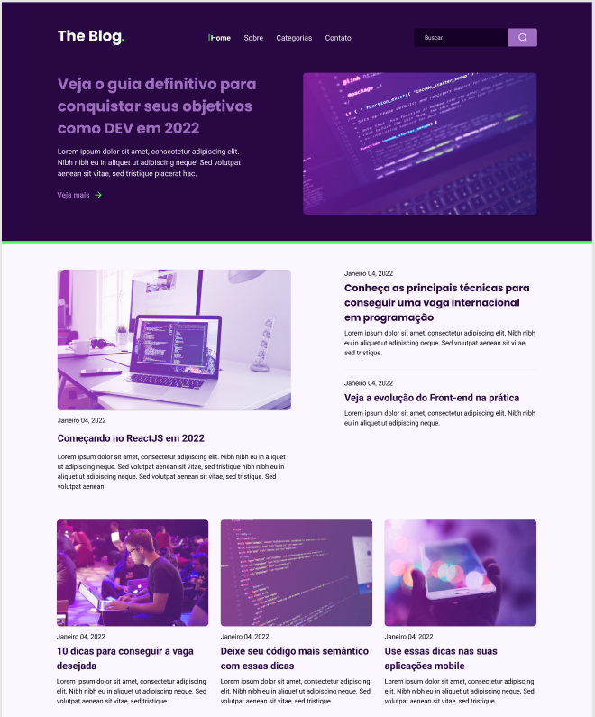

# Desafio_RocketBlog

Desafio Rocketseat, desenvolvimento de uma homepage para um blog

<p align="center">
  
</p>

## 💻 Projeto

Dependências usadas no projeto:

- [ViteJS](https://vitejs.dev/)
- [Sass](https://sass-lang.com/)
- [TypeScript](https://www.typescriptlang.org/)

## 📥 Instalação e execução

Faça um clone desse template e acesse o diretório.

```bash
# Instalando as dependências
$ yarn
# Executanto aplicação
$ yarn dev
```
